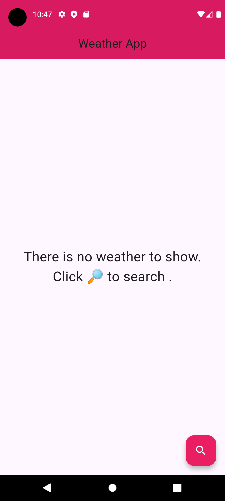
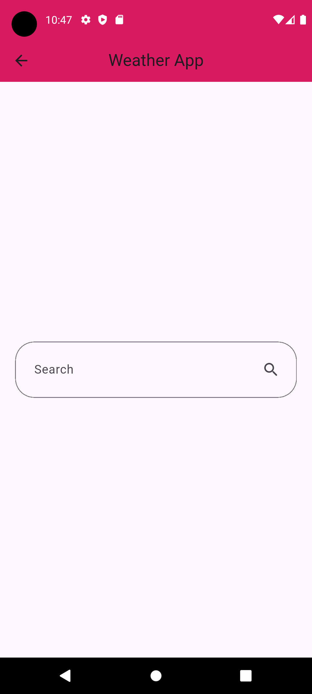
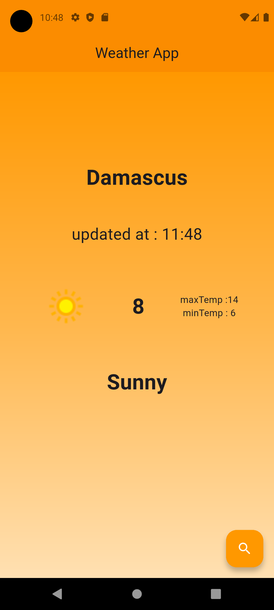
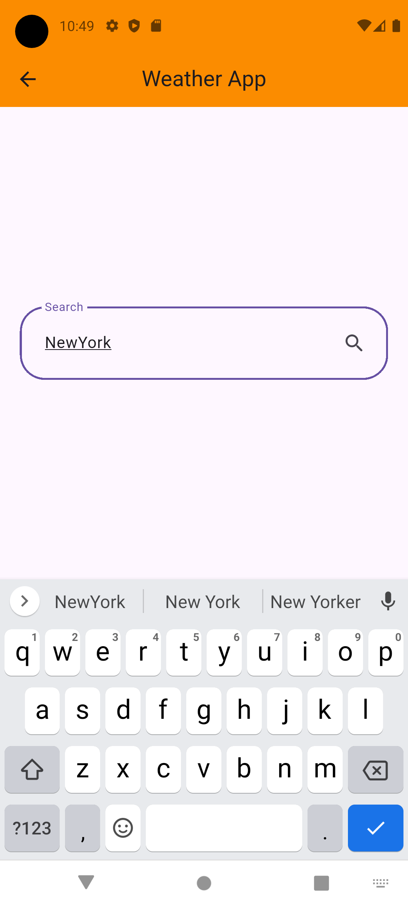

# 🌤 Simple Weather App using Flutter

A simple and clean weather application built with Flutter that allows users to search for a city and view current weather information with dynamic theming based on weather conditions.

---

## ✨ Features

- Search weather by city name
- Display current temperature, max & min temperature
- Weather condition description and icon
- Dynamic UI theme based on weather state
- Gradient background that changes with weather
- State management using Provider
- Clean separation of UI, logic, and services

---

## 🛠 Tech Stack

- Flutter
- Dart
- Provider (State Management)
- REST API (WeatherAPI)
- HTTP package

---

## 🧠 Architecture Overview

- **Provider** is used to manage and update weather data across the app.
- **WeatherService** handles API requests and data fetching.
- **WeatherModel** maps API response into a clean Dart model.
- UI updates automatically when weather data changes.

---

## 📸 Screenshots

<p float="left">
  
  
  
  
  
</p>

---

## 🎥 App Demo


---

## 🚀 Getting Started

### Prerequisites

- Flutter SDK installed
- Internet connection (API-based app)

### Run the App

```bash
flutter pub get
flutter run
```
